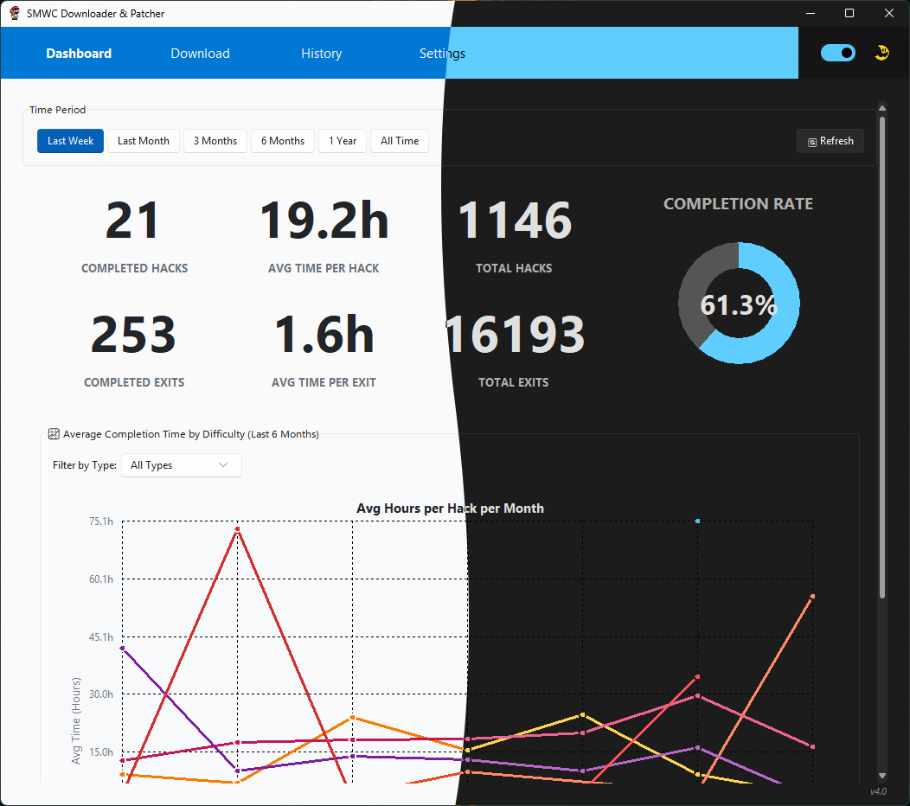
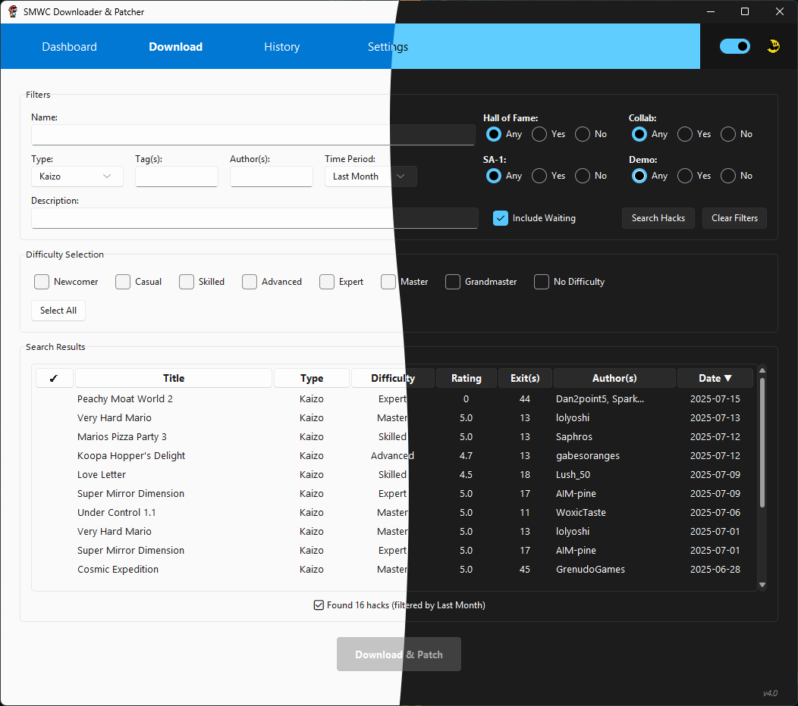
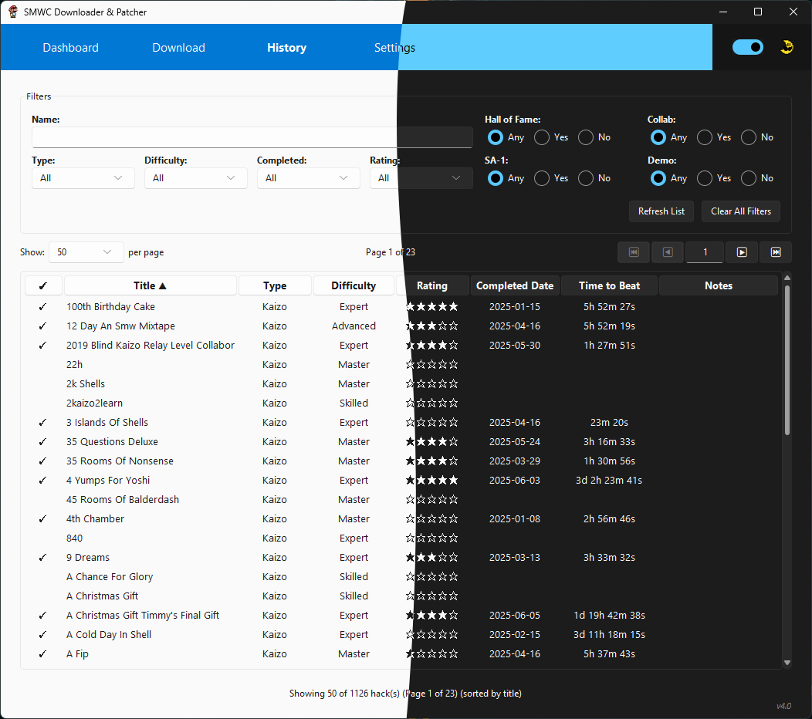
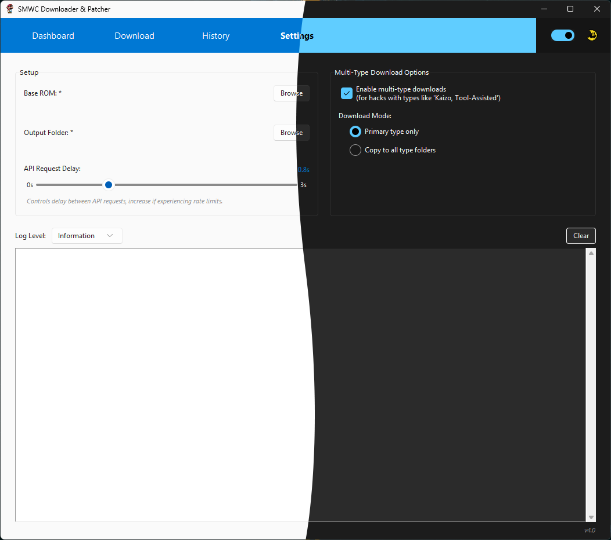

# SMWCentral Downloader & Patcher v4.0

A powerful desktop application for downloading, organizing, and patching Super Mario World ROM hacks from SMWCentral. Streamline your hack discovery and management with advanced filtering, bulk downloads, and comprehensive analytics.



## ✨ Features

### 🔍 Advanced Hack Discovery
- **Individual Download Page**: Browse and filter through thousands of hacks with advanced search options
- **Smart Filtering**: Filter by difficulty, type, authors, completion status, and more
- **Real-time Search**: Instant results as you type
- **Detailed Previews**: View hack information, screenshots, and ratings before downloading



### 📥 Intelligent Download System
- **Bulk Downloads**: Select and download multiple hacks simultaneously
- **Smart Organization**: Automatically organizes hacks by type and difficulty
- **Multi-Type Support**: Handles Standard, Kaizo, Puzzle, Tool-Assisted, and Pit hacks
- **Cancellable Downloads**: Stop download operations at any time
- **Duplicate Detection**: Prevents downloading the same hack twice and automatically manages obsolete versions

### 📊 Comprehensive Analytics
- **Collection Overview**: Visual dashboard showing your hack statistics
- **Progress Tracking**: Track completion status and personal ratings
- **Type Distribution**: See your preferences across different hack categories
- **Advanced Metrics**: Detailed analytics about your gaming habits

### 🗂️ Powerful History Management
- **Complete History**: View all downloaded hacks with detailed information
- **Advanced Sorting**: Sort by any column with visual indicators
- **Inline Editing**: Edit hack details directly in the table
- **Bulk Operations**: Update multiple hacks at once
- **Export Options**: Export your collection data



### ⚙️ Professional Configuration
- **Flexible Settings**: Configure base ROM paths, output directories, and preferences
- **Theme Support**: Switch between light and dark themes
- **Multi-Type Downloads**: Choose to download hacks to multiple type folders
- **Performance Options**: Adjust download delays and concurrent operations



## 🚀 Quick Start

### First Time Setup
1. **Download** the latest release from the [releases page](../../releases)
2. **Extract** the files to your desired location
3. **Run** `SMWC Downloader.exe`
4. **Configure** your base ROM path and output directory in Settings
5. **Start downloading** hacks from the Download page!

### Configuration
Before downloading hacks, you'll need to:

1. **Set Base ROM Path**: Point to your clean Super Mario World ROM file
2. **Set Output Directory**: Choose where patched hacks will be saved
3. **Configure Preferences**: Adjust download settings and organization options

The app will automatically create organized folders for different hack types and difficulties.

## � File Organization

The application automatically organizes your hacks in a clean structure:

```
Output Directory/
├── Standard/
│   ├── 01 - Newcomer/
│   ├── 02 - Casual/
│   ├── 03 - Skilled/
│   ├── 04 - Advanced/
│   ├── 05 - Expert/
│   ├── 06 - Master/
│   ├── 07 - Grandmaster/
│   └── 08 - No Difficulty/
├── Kaizo/
│   ├── 01 - Newcomer/
│   ├── 02 - Casual/
│   ├── 03 - Skilled/
│   ├── 04 - Advanced/
│   ├── 05 - Expert/
│   ├── 06 - Master/
│   ├── 07 - Grandmaster/
│   └── 08 - No Difficulty/
├── Puzzle/
│   ├── 01 - Newcomer/
│   ├── 02 - Casual/
│   ├── 03 - Skilled/
│   ├── 04 - Advanced/
│   ├── 05 - Expert/
│   ├── 06 - Master/
│   ├── 07 - Grandmaster/
│   └── 08 - No Difficulty/
├── Tool-Assisted/
│   ├── 01 - Newcomer/
│   ├── 02 - Casual/
│   ├── 03 - Skilled/
│   ├── 04 - Advanced/
│   ├── 05 - Expert/
│   ├── 06 - Master/
│   ├── 07 - Grandmaster/
│   └── 08 - No Difficulty/
└── Pit/
    ├── 01 - Newcomer/
    ├── 02 - Casual/
    ├── 03 - Skilled/
    ├── 04 - Advanced/
    ├── 05 - Expert/
    ├── 06 - Master/
    ├── 07 - Grandmaster/
    └── 08 - No Difficulty/
```

**All hack types** use difficulty-based subfolders for consistent organization.

## � Technical Details

### Requirements
- **OS**: Windows 10 or later
- **Storage**: ~20 MB for application + space for your hack collection
- **Network**: Internet connection for downloading hacks
- **ROM**: Clean Super Mario World ROM file

### File Formats
- **Input**: Supports .zip files containing .ips or .bps patches from SMWCentral
- **Output**: Generates patched .smc/.sfc ROM files ready to play
- **Database**: Uses JSON format for hack metadata and progress tracking
- **Configuration**: Automatic migration system for seamless upgrades

### Key Files
- **`config.json`**: Application configuration and settings
- **`processed.json`**: Database of downloaded hacks and metadata
- **`README.md`**: This documentation file

## 📝 Changelog

### v4.0.0 - Major Release
- **New**: Individual Download page with advanced filtering
- **New**: Comprehensive Dashboard with analytics
- **New**: Multi-type hack support system
- **Enhanced**: History page with inline editing
- **Enhanced**: Improved Settings with more options
- **Enhanced**: Modern UI with light/dark theme support
- **Fixed**: Numerous stability and performance improvements

## 🆘 Troubleshooting

### Common Issues

**Downloads not working?**
- Check your internet connection
- Verify the hack is still available on SMWCentral
- Make sure you have write permissions to the output directory

**Patches failing?**
- Ensure your base ROM is a clean, unmodified Super Mario World ROM
- Check that you have enough disk space
- Verify the ROM file isn't corrupted

**Application won't start?**
- Make sure you have the latest Windows updates
- Try running as administrator
- Check that your antivirus isn't blocking the application

### Getting Help
If you encounter issues:
1. Check the application logs for error messages
2. Try restarting the application
3. Verify your configuration settings
4. Create an issue on the GitHub repository with details

## 🤝 Contributing

This project welcomes contributions! Whether it's bug reports, feature requests, or code contributions, your help makes this tool better for everyone.

## 📄 License

This project is licensed under the MIT License - see the LICENSE file for details.

---

**Version**: 4.0.0  
**Last Updated**: July 2025  
**Platforms**: Windows 10/11

🍄 **Happy Hacking!** ✨
