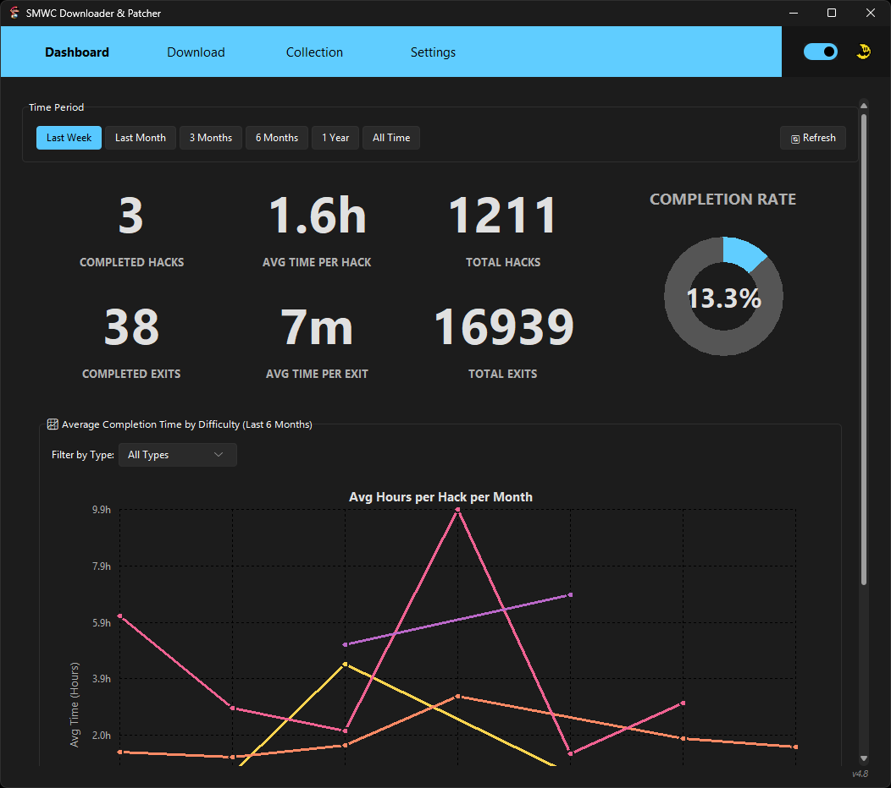
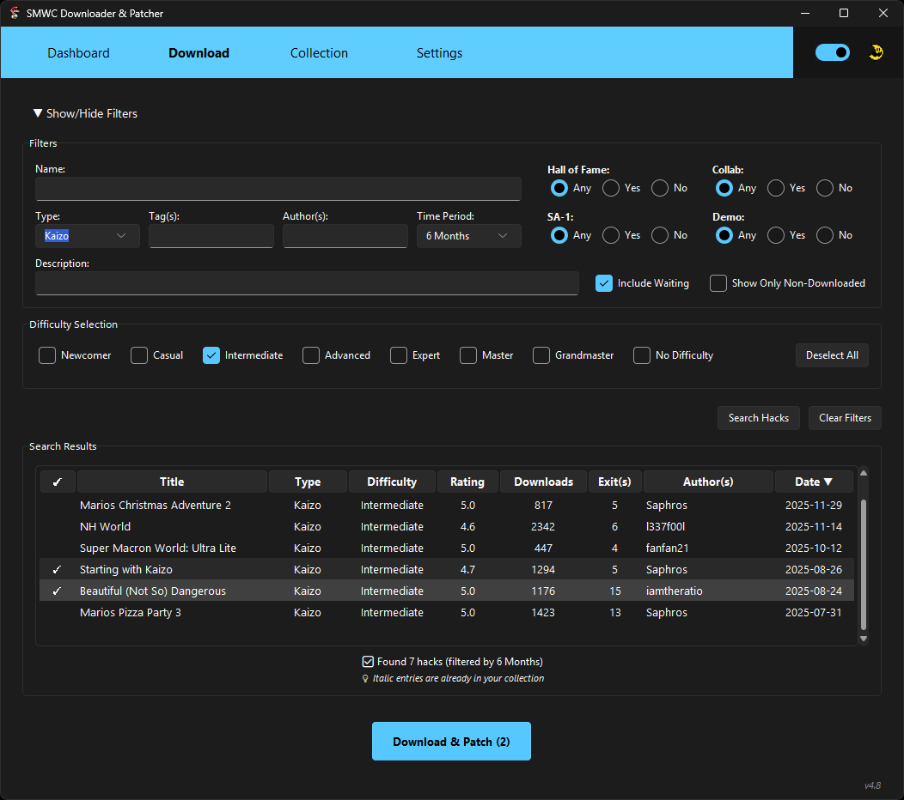
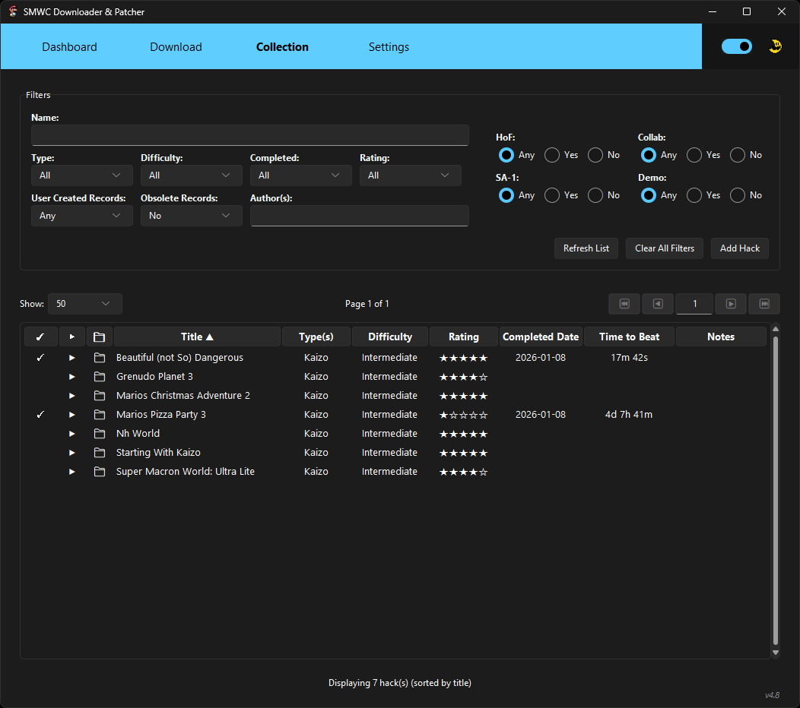
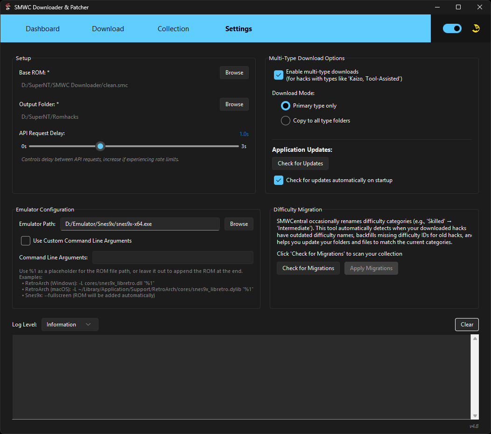

# SMWC Downloader & Patcher

🎮 **Download and play Super Mario World ROM hacks with one click**

A simple desktop app that automatically downloads, patches, and organizes ROM hacks from SMWCentral. Works on Windows, Mac, and Linux.



## 📋 Table of Contents

- [📥 Download & Install](#-download--install)
- [🚀 How to Use](#-how-to-use)
- [🛠️ Troubleshooting](#️-troubleshooting)
- [📝 What You Need](#-what-you-need)
- [📝 Changelog](#-changelog)

## 📥 Download & Install

### Windows (10/11)
1. Download `SMWC-Downloader-Windows-x64.zip` from the [Releases page](../../releases)
2. Extract the ZIP file to any folder you want (like your Desktop or Program Files)
3. Double-click `SMWC Downloader.exe` to run the app
4. **If Windows shows a security warning**: Click "More info" → "Run anyway" (this is normal for new apps)

> [!IMPORTANT]
> Windows may flag this app because it's new and unsigned. This is normal!
> 
> **If you see warnings:**
> - **Browser**: Click "Keep" if download gets blocked
> - **Windows Defender**: Click "More info" → "Run anyway" 
> - **To prevent future warnings**: Add the app folder to Windows Defender exclusions in Settings → Update & Security → Windows Security → Virus & threat protection → Exclusions

### Mac (macOS 10.15+)
1. Download `SMWC-Downloader-macOS-Universal.dmg` from the [Releases page](../../releases)
2. Open the DMG file and drag the app to your Applications folder
3. **First time only**: Right-click the app → "Open" → "Open" (to bypass security warning)
4. After that, you can launch it normally from Applications or Spotlight

### Linux (Ubuntu, Debian, Fedora, etc.)
1. Download `SMWC-Downloader-Linux-x64.tar.gz` from the [Releases page](../../releases)
2. Extract: `tar -xzf SMWC-Downloader-*.tar.gz`
3. Run the installer: `./install.sh` (this adds the app to your Applications menu)
4. Launch from Applications menu or run `smwc-downloader` in terminal

## 🚀 How to Use

### First Time Setup
1. **Launch the app** - it will open to the main dashboard
2. **Go to Settings**: Click the "Settings" tab at the top of the app
3. **Set your ROM folder**: Click the folder icon to choose where you want your patched ROMs saved
4. **Add your base ROM**: Click "Browse" next to "Super Mario World ROM" and select your clean SMW ROM file
5. **You're ready!** The app will remember these settings and you can return to the main dashboard

### Downloading ROM Hacks
1. **Set your filters**: Use the filter options to narrow down what you want to search for (difficulty, type, author, etc.)
2. **Choose display mode**: Use the "Show only non-downloaded hacks" checkbox to hide hacks you already own, making it easier to find new content
3. **Search for hacks**: Click the "Search Hacks" button to pull data from the SMWCentral API based on your filters
4. **Browse results as they load**: Results appear progressively as each page loads - no need to wait for all data to finish loading
5. **Select hacks to download**: Click the checkmark in the first column for each hack you want to download
   - **Tip**: Click the column header to select ALL hacks at once
   - **Already downloaded hacks** are shown in italic with muted colors to help you identify what you already own
6. **Start downloading**: Click "Download & Patch" to begin downloading and patching your selected hacks
7. **Wait for completion**: The app will automatically download each hack and apply it to your base ROM
8. **Play**: Your patched ROMs will be saved to your chosen folder, ready to play in any emulator



### Managing Your Collection
1. **View your collection**: Click the "Collection" tab to see all your downloaded ROMs
2. **Customize columns**: Click the "⚙ Columns" button to show/hide columns and reorder them via drag-and-drop
   - Drag column names to reorder (visual feedback shows what you're moving)
   - Check/uncheck boxes to show/hide specific columns
   - Click "Reset to Default" to restore original layout
   - Your preferences are saved automatically
3. **Add hacks manually**: Use the "Add Hack" button to track hacks you've played from other sources
4. **Track progress**: Mark hacks as completed, rate them (1-5 stars), and add personal notes
5. **Quick editing**: Click directly on completion dates, time to beat, or notes to edit them
6. **Advanced editing**: Double-click any hack to open the full edit dialog
7. **�️ Delete a hack**: Inside the edit dialog, click **Delete** to permanently remove a hack from your collection
   - If a ROM file is associated with the hack, it will also be deleted from your file system
   - A clear confirmation prompt tells you exactly what will be removed before you confirm
   - Works for both downloaded SMWC hacks and manually added hacks
8. **📁 Quick file access**: Click the folder icon next to any hack name to instantly open its file location in your system's file manager
9. **🎮 Quick launch**: Click the play icon (▶) next to any hack to launch it directly in your configured emulator
10. **Filter and sort**: Use filters to find specific hacks, or click column headers to sort



#### Input Format Guide

When editing **Completed Date** and **Time to Beat** fields, the app supports flexible input formats:

**📅 Date Formats:**
- `MM/DD/YYYY` - Example: `12/25/2024`
- `MM-DD-YYYY` - Example: `12-25-2024`
- `MM.DD.YYYY` - Example: `12.25.2024`
- `YYYY/MM/DD` - Example: `2024/12/25`
- `YYYY-MM-DD` - Example: `2024-12-25`

**⏱️ Time to Beat Formats:**

| Format Type | Pattern | Examples | Description |
|-------------|---------|----------|-------------|
| **Colon-Separated** | `HH:MM:SS` | `1:30:45`, `12:05:30` | Hours:Minutes:Seconds |
| | `MM:SS` | `90:30`, `5:15` | Minutes:Seconds |
| **Letter Suffix** | `XhYmZs` | `2h 30m 15s`, `1h 45m`, `90m`, `45s` | Hours/minutes/seconds with letters |
| | *Flexible spacing* | `2h30m15s` = `2h 30m 15s` | Spaces optional |
| **Day Formats** | `XdYhZmWs` | `14d 10h 2m 1s`, `7d 12h`, `2d` | Days/hours/minutes/seconds |
| | *Shortened* | `14d 10` (assumes hours) | Advanced shorthand |
| **Word-Based** | `X minutes/mins` | `150 minutes`, `90 mins` | Full word formats |
| **Simple Number** | `X` | `90`, `5`, `120` | Just a number (assumes minutes) |

### App Settings
- **Download location**: Change where ROMs are saved
- **Multi-type downloads**: Configure how hacks with multiple types (like "Kaizo, Tool-Assisted") are handled
  - **Primary only**: Download to the main type folder only
  - **Copy to all folders**: Create copies in each applicable type folder
- **Emulator integration**: Configure your favorite emulator to launch games directly from the Collection page
  - Supports RetroArch, Snes9x, and any other emulator
  - Custom command-line arguments with `%1` placeholder support
  - Cross-platform: Windows, macOS (.app bundles), and Linux
- **Data Migration**: Keep your collection metadata up-to-date
  - **Check Difficulties**: Detect outdated difficulty categories from SMWC renames
  - **Apply Fixes**: Automatically migrate folders and update metadata
  - **Fetch Metadata**: Bulk update missing release dates for your entire collection
    - Optimized bulk API (completes in under 1 minute for most collections)
    - Finds metadata for obsolete/unlisted hacks via fallback lookups
    - Cancellable operation (safe to cancel during fetch phase)
- **Auto-updates**: Choose if you want automatic app updates
- **Theme**: Switch between light and dark modes with instant, smooth transitions and optimized performance
- **API Delay Slider**: Set delay from 0.0 to 3.0 seconds between API requests to avoid rate limiting issues



### Emulator Configuration

The app supports launching ROMs directly in your favorite emulator with one click!

#### Setup Instructions

1. **Go to Settings** → **Emulator Configuration**
2. **Browse for your emulator executable**:
   - **Windows**: Select the `.exe` file (e.g., `snes9x-x64.exe`, `retroarch.exe`)
   - **macOS**: Select the `.app` bundle (e.g., `Snes9x.app`) - the app will automatically find the executable inside
   - **Linux**: Select the binary (e.g., `/usr/bin/snes9x-gtk`, `/usr/games/retroarch`)
3. **Optional: Add command-line arguments**
   - Check "Use Custom Command Line Arguments"
   - Enter your desired arguments (see examples below)
4. **Save and test**: The play icon (▶) will appear next to downloaded hacks in your Collection

#### Command-Line Arguments Examples

**RetroArch (Windows):**
```
-L cores/snes9x_libretro.dll "%1"
```

**RetroArch (macOS):**
- Emulator Path: `/Applications/RetroArch.app/Contents/MacOS/RetroArch`
- Command Line Arguments:
```
-L "~/Library/Application Support/RetroArch/cores/snes9x_libretro.dylib" "%1"
```

**RetroArch (Linux):**
```
-L ~/.config/retroarch/cores/snes9x_libretro.so "%1"
```

**Snes9x:**
```
--fullscreen
```

**Custom Arguments:**
- Use `%1` as a placeholder for the ROM file path
- If you don't use `%1`, the ROM will be automatically added at the end
- Arguments are parsed with proper quote handling

#### Platform-Specific Notes

**Windows:**
- Browse for `.exe` files
- Emulator runs without console window

**macOS:**
- Browse for `.app` bundles (e.g., `Snes9x.app`, `RetroArch.app`)
- The app automatically converts `.app` paths to the actual executable inside
- Example: `Snes9x.app` → `Snes9x.app/Contents/MacOS/Snes9x`

**Linux:**
- Browse for binaries in `/usr/bin/`, `/usr/games/`, or custom locations
- Make sure the binary has execute permissions
- Folder picker dialogs use the native system chooser (GTK/KDE portal) instead of the built-in Tk widget, giving you a proper vertical-scroll file browser on both X11 and Wayland

## 🛠️ Troubleshooting

### Windows Security Warning
Windows may show "Windows protected your PC" when running the app. This is normal for new applications. Click "More info" → "Run anyway" to continue.

### Mac Security Warning
macOS may say the app is from an "unidentified developer." Right-click the app → "Open" → "Open" to bypass this. You only need to do this once.

### Linux: App Won't Start
If the app won't launch, install these packages:
- **Ubuntu/Debian**: `sudo apt install python3-tk`
- **Fedora**: `sudo dnf install tkinter`

### Can't Find Downloaded ROMs
Check the folder path shown in Settings. By default, ROMs are saved to:
- **Windows**: `Desktop\SMWCentral Hacks\`
- **Mac**: `Desktop/SMWCentral Hacks/`
- **Linux**: `~/Desktop/SMWCentral Hacks/`

### Emulator Won't Launch
If clicking the play icon doesn't work:
1. **Check emulator path**: Go to Settings → Emulator Configuration and verify the path is correct
2. **macOS users**: Make sure you selected the `.app` file, not the executable inside
3. **Check arguments**: Disable "Use Custom Command Line Arguments" to test without arguments first
4. **Test manually**: Try launching your emulator with a ROM file manually to ensure it works
5. **Check logs**: Go to Settings page and check the log output for error messages

## 📝 What You Need

- **Your Operating System**: Windows 10+, macOS 10.15+, or modern Linux
- **A clean SMW ROM**: Unmodified Super Mario World ROM file (.smc or .sfc)
- **Storage space**: About 20 MB for the app, plus space for your ROM collection
- **Internet connection**: Required for downloading hacks and app updates
- **Optional - Emulator**: Any SNES emulator (Snes9x, RetroArch, bsnes, etc.) for the quick-launch feature

##  Changelog

</details>

<details open>
<summary><strong>Version 4.9 - Latest Release (January 2026)</strong></summary>

### 🆕 New Features

**Column Configuration**
- **Customizable Collection View**: Show/hide columns and reorder them via intuitive drag-and-drop
  - Click "⚙ Columns" button above the Collection table to configure
  - Visual feedback shows column name while dragging
  - Check/uncheck boxes to control column visibility
  - "Reset to Default" restores original layout
  - Preferences persist across app sessions

**Fetch Metadata - Supercharged**
- **Bulk Metadata Updates**: Update missing release dates for your entire collection from SMWCentral
  - **60-100x faster** than previous versions (under 1 minute vs 30+ minutes)
  - Uses optimized bulk API fetching for active hacks
  - Fallback individual lookups for obsolete/unlisted hacks
  - Checks both moderated AND waiting sections
  - **Cancellable operation** - safe to cancel during API fetch phase
  - Access via Settings → Data Migration → "Fetch Metadata"

**Delete Any Hack**
- **Expanded deletion support**: The Delete button in the edit dialog now works for all hacks, not just manually added ones
  - Permanently removes the entry from your collection history
  - If a ROM file is linked to the hack, it is also deleted from your file system
  - Confirmation prompt clearly states whether a file will be deleted
  - Handles orphaned records (JSON entry exists but file is already gone) gracefully

**Linux Native Folder Picker**
- **Better folder selection on Linux**: Folder browse dialogs now use the native system picker instead of Tk's built-in horizontal-scroll widget
  - Automatically uses `zenity` (GNOME/GTK) or `kdialog` (KDE) via XDG Desktop Portals
  - Works correctly on both X11 and Wayland
  - Falls back silently to the Tk dialog if neither tool is available
  - No impact on Windows or macOS behaviour

**UI Consistency & Polish**
- **Themed Status Colors**: Consistent, readable colors across all status messages
  - Info/In-Progress: Light cyan (`#4FC3F7`) - much more visible than previous blue
  - Success: Green (`#66BB6A`)
  - Warning: Orange (`#FFA726`)
  - Error: Red (`#EF5350`)
  - Centralized theme constants in `ui_constants.py`

**Data Protection**
- **Collection Page Locking**: Prevents editing during background operations
  - Locks during: Fetch Metadata, Difficulty Migrations, Silent Updates
  - Shows "⏸️ Collection locked" message with operation reason
  - Auto-unlocks when operation completes, fails, or is cancelled

### 🔧 Improvements
- **Cleaner Logging**: Simplified messages prevent UI clutter
  - "🔄 Reloaded X hacks from disk" (removed debug paths)
  - Shortened migration messages to prevent layout overflow
- **Layout Optimizations**: Data Migration text wrapping adjusted to prevent cutoff
- **Metadata Dialog**: Updated to reflect bulk optimization and cancellation features

### 🐛 Bug Fixes
- **Column Configuration**: Fixed TclError crashes during drag-and-drop
  - Added widget existence checks before updates
  - Robust error handling prevents UI freezes
- **Column Sort After Reorder**: Fixed data jumbling when sorting after reordering columns
  - Reordering columns (e.g. moving the ✓ Completed column) and then sorting by any header no longer scrambles row data
  - Sort indicators and click commands now correctly reflect the actual displayed column order
- **Reset to Default**: Fixed button not working (config validation issue)
- **Duplicate Logging**: Fixed "Reloaded X hacks" appearing twice on Refresh
- **Obsolete Hacks**: Fixed metadata fetch not updating old/replaced hack versions
  - Now uses individual API lookups as fallback
  - Warns about hacks that couldn't be updated

</details>

<details>
<summary><strong>Version 4.8 - Previous Release</strong></summary>

### 🆕 New Features
- **Emulator Integration**: Launch ROMs directly from the Collection page with one click
  - Configure any emulator (RetroArch, Snes9x, bsnes, etc.)
  - Custom command-line arguments with `%1` placeholder support
  - Cross-platform support: Windows, macOS (.app bundles), and Linux
  - Play icon (▶) appears next to downloaded hacks when emulator is configured
- **macOS .app Bundle Support**: Automatic conversion of `.app` bundles to executable paths
  - Select `Snes9x.app` and the app automatically finds `Snes9x.app/Contents/MacOS/Snes9x`
  - Works with all standard macOS application bundles
- **Live Difficulty Mapping from SMWC API**: Automatically fetches current difficulty categories from SMWC on app startup
  - Difficulty mappings cached in config.json for offline use
  - Ensures app always uses latest SMWC difficulty names without code updates
- **Difficulty Migration System**: Automatic detection and migration of SMWC difficulty category renames
  - Auto-detects when difficulty names have changed by comparing against live SMWC data
  - Migration UI in Settings page with check/apply buttons
  - Automatically renames difficulty folders and updates file paths
- **Automatic v4.8 Migration**: Seamless upgrade from v4.7
  - Automatically adds new fields to existing hacks on first launch
  - Silent migration - no user intervention needed

### 🔧 Improvements
- Settings page layout optimized: Emulator and Difficulty Migration sections now side-by-side for better space utilization
- Enhanced log section with more vertical space
- Improved cross-platform emulator path handling
- Updated difficulty category from "Skilled" to "Intermediate" to match SMWC
- Collection page Type filter now correctly finds multi-type hacks
- Difficulty data model consolidated for better performance

### 🐛 Bug Fixes
- Fixed Type filter not finding multi-type hacks (e.g., searching "Puzzle" now finds "Standard, Puzzle")
- Fixed Collection page difficulty filter with new data model
- Removed false migration warnings

</details>

<details>
<summary><strong>Previous Versions</strong></summary>

### v4.7.0

### 🔧 Improvements
- **Enhanced Download Selection**: Click anywhere on a search result row to select/deselect hacks for download
- **Improved Filter Layout**: Responsive filter sections work better when window is maximized
- **Clearer Filter Controls**: Renamed "Search Criteria" to "Show/Hide Filters" for better clarity


### v4.6.0

### 🐛 Bug Fixes
- **Time Parsing Accuracy**: Fixed critical bug where time inputs like "27m 22s" were incorrectly parsed as "2h 7m 22s"
- **Input Format Reliability**: Improved regex pattern matching order to handle all time formats correctly
- **Data Integrity**: Ensures accurate time-to-beat tracking in Collection page

### 🔧 Improvements
- **Auto-Refresh on Navigation**: Dashboard and Collection pages now automatically refresh data when navigating between tabs
- **Enhanced Input Validation**: Better handling of edge cases in time parsing (supports days, overflow values, etc.)

### v4.5.0

### 🚀 New Features
- **Progressive Data Loading**: Results display as each page loads from the API for instant review
- **Already Downloaded Indicator**: Downloaded hacks shown in italic with muted colors
- **Smart Collection Filtering**: "Show only non-downloaded hacks" checkbox for faster browsing
- **Enhanced Theme System**: Improved color management and visual consistency
- **Performance Optimizations**: Faster theme updates and UI responsiveness

### 🔧 Improvements
- **Search Experience**: Browse results immediately as data loads
- **Collection Management**: Better visual distinction and filtering for owned content
- **Theme Performance**: Optimized color updates across light and dark modes
- **UI Polish**: Consistent visual elements during theme transitions

### 🐛 Bug Fixes
- Fixed dark gray selection colors appearing in light mode
- Resolved delays in theme color updates for downloaded indicators
- Fixed visual inconsistencies during theme switching

### v4.5.0

### 🚀 New Features
- **Progressive Data Loading**: Results display as each page loads from the API for instant review
- **Already Downloaded Indicator**: Downloaded hacks shown in italic with muted colors
- **Smart Collection Filtering**: "Show only non-downloaded hacks" checkbox for faster browsing
- **Enhanced Theme System**: Improved color management and visual consistency
- **Performance Optimizations**: Faster theme updates and UI responsiveness

### 🔧 Improvements
- **Search Experience**: Browse results immediately as data loads
- **Collection Management**: Better visual distinction and filtering for owned content
- **Theme Performance**: Optimized color updates across light and dark modes
- **UI Polish**: Consistent visual elements during theme transitions

### 🐛 Bug Fixes
- Fixed dark gray selection colors appearing in light mode
- Resolved delays in theme color updates for downloaded indicators
- Fixed visual inconsistencies during theme switching

</details>

<details>
<summary><strong>Previous Versions</strong></summary>

### v4.4.0
- **Cross-Platform Support**: Full compatibility with Windows, macOS, and Linux
- **Download State Management**: Collection tab is now locked during active downloads to prevent data corruption
- **Enhanced Dashboard Analytics**: Improved accuracy and data tracking for collection metrics

### v4.3.0
- Dashboard implementation with analytics and charts
- Collection page with comprehensive filtering and editing
- Theme support (light/dark modes)
- Improved bulk download workflow

### v4.2.0
- Multi-type download support
- Enhanced search and filtering capabilities
- Progress tracking improvements
- Bug fixes and stability improvements

### v4.1.0
- Initial release with core downloading functionality
- Basic patching system
- Simple collection tracking
- Windows-only support

</details>

---

**Made for the Super Mario World ROM hacking community** ❤️
