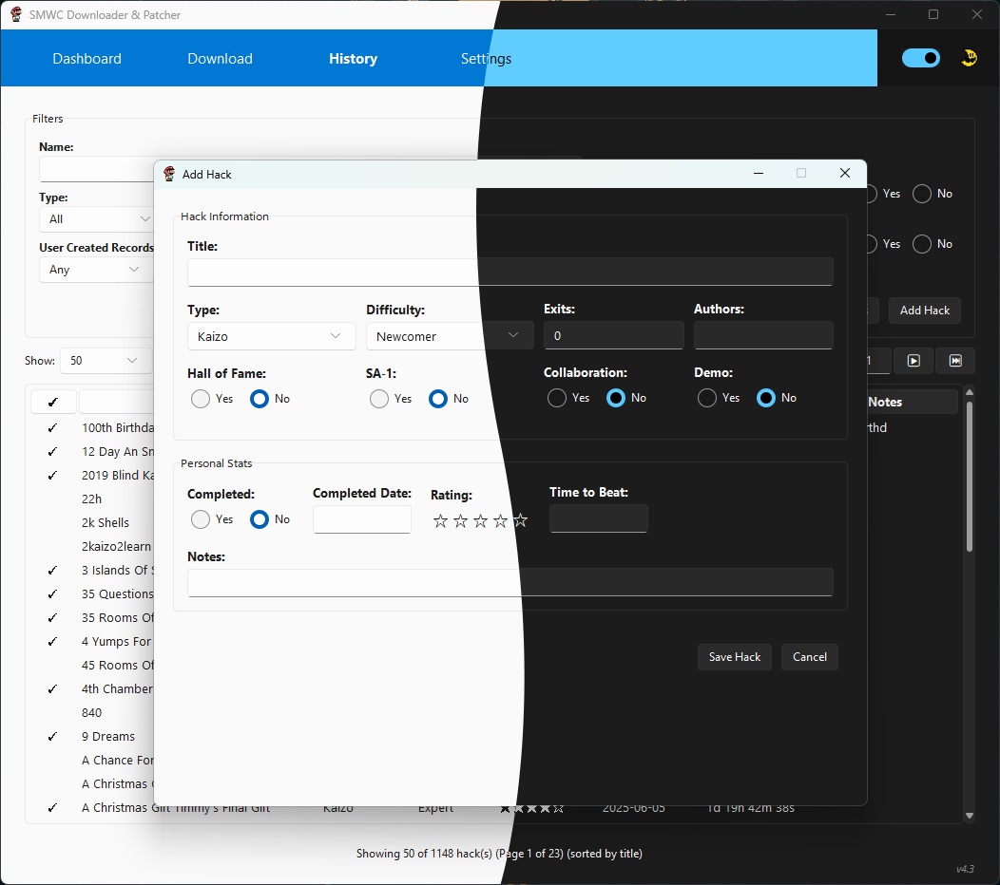

# SMWCentral Downloader & Patcher v4.4

A powerful **cross-platform** desktop application for downloading, organizing, and patching Super Mario World ROM hacks from## 🔧 Technical Details

### System Requirements

| Platform | Minimum Requirements | Notes |
|----------|---------------------|--------|
| **Windows** | Windows 10 (1903+) or Windows 11 | 64-bit architecture |
| **macOS** | macOS 10.15+ (Catalina or newer) | Universal binary (Intel + Apple Silicon) |
| **Linux** | Modern distribution with GTK support | Ubuntu 18.04+, Debian 10+, Fedora 32+, etc. |

**All Platforms**:
- **Storage**: ~20 MB for application + space for your hack collection
- **Network**: Internet connection for downloading hacks and updates
- **ROM**: Clean Super Mario World ROM file

### Cross-Platform Features
- **Identical Functionality**: All features work the same across Windows, macOS, and Linux
- **Native Look & Feel**: Application adapts to each platform's UI conventions
- **Platform-Specific Optimizations**: Mouse wheel scrolling, keyboard shortcuts, and file dialogs optimized per platform
- **Unified Auto-Updates**: Single update system that works seamlessly across all platforms

### File Formats & Compatibility
- **Input**: Supports .zip files containing .ips or .bps patches from SMWCentral
- **Output**: Generates patched .smc/.sfc ROM files ready to play on any platform
- **Database**: Uses JSON format for hack metadata and progress tracking (cross-platform compatible)
- **Configuration**: Automatic migration system for seamless upgrades across platform switches

### Architecture
- **Windows**: PyInstaller executable with embedded Python runtime
- **macOS**: Native .app bundle with Universal binary support (Intel + Apple Silicon)
- **Linux**: Portable executable with GTK+ integration
- **Auto-Updater**: Platform-aware update system with format detection (.zip/.dmg/.tar.gz)

### Key Files
- **`config.json`**: Application configuration and settings (cross-platform)
- **`processed.json`**: Database of downloaded hacks and metadata (cross-platform)
- **`README.md`**: This documentation filemline your hack discovery and management with advanced filtering, bulk downloads, comprehensive analytics, and automatic updates.

**Now available on Windows, macOS, and Linux!**


## 🖥️ Platform Support

| Platform | Status | Download Format | Notes |
|----------|--------|-----------------|-------|
| **Windows** | ✅ Fully Supported | `.zip` archive | Windows 10 (1903+) or Windows 11 |
| **macOS** | ✅ Fully Supported | `.dmg` installer | macOS 10.15+ (Catalina or newer) |
| **Linux** | ✅ Fully Supported | `.tar.gz` archive | Modern distributions with GTK support |

All platforms feature **identical functionality** including the auto-updater, which automatically detects your operating system and downloads the correct version.

## 📋 Table of Contents

- [Platform-Specific Setup](#-platform-specific-setup)
  - [Windows Setup](#windows-setup)
  - [macOS Setup](#macos-setup) 
  - [Linux Setup](#linux-setup)
- [First-Time Configuration](#-first-time-configuration)
- [Features](#-features)
- [File Organization](#-file-organization)
- [Technical Details](#-technical-details)
- [Changelog](#-changelog)
- [Troubleshooting](#-troubleshooting)
- [Contributing](#-contributing)
- [License](#-license)

## 🚀 Platform-Specific Setup

### Windows Setup
1. **Download** `SMWC-Downloader-v4.4-Windows-x64.zip` from [releases](../../releases)
2. **Extract** all files to a folder of your choice (e.g., `C:\SMWCentral Downloader\`)
3. **Run** `SMWC Downloader.exe` to start the application
4. **Optional**: Run `defender_exclusion.bat` as Administrator to prevent Windows Defender false positives

> **Windows Defender Note**: PyInstaller executables may trigger antivirus warnings. This is a common false positive. Use the included exclusion script or manually add the folder to Windows Defender exclusions.

### macOS Setup
1. **Download** `SMWC-Downloader-v4.4-macOS-Universal.dmg` from [releases](../../releases)
2. **Open** the DMG file and drag `SMWC Downloader.app` to your Applications folder
3. **Launch** from Applications or Spotlight search
4. **First Launch**: Right-click → "Open" to bypass Gatekeeper (required once for unsigned apps)

> **Gatekeeper Note**: macOS may warn about an unidentified developer. This is normal for open-source software. Right-click the app and select "Open" to bypass this warning.

### Linux Setup
1. **Download** `SMWC-Downloader-v4.4-Linux-x64.tar.gz` from [releases](../../releases)
2. **Extract** the archive: `tar -xzf SMWC-Downloader-v4.4-Linux-x64.tar.gz`
3. **Make executable**: `chmod +x "SMWC Downloader"`
4. **Run** from terminal: `./SMWC\ Downloader` or double-click in file manager

> **Dependencies**: Most modern Linux distributions include the required GTK libraries. If you encounter missing dependencies, install `python3-tkinter` and `libgtk-3-0` through your package manager.

## ⚙️ First-Time Configuration

After launching the application on any platform:

### Step 1: Configure Paths
1. **Navigate to Settings** (click the Settings tab at the top)
2. **Set Base ROM Path**: 
   - Click "Browse" next to "Base ROM Path"
   - Select your clean Super Mario World ROM file (.smc or .sfc)
   - ⚠️ **Important**: Use an unmodified, original SMW ROM
3. **Set Output Directory**:
   - Click "Browse" next to "Output Directory" 
   - Choose where you want your patched hacks to be saved
   - The app will create organized folders automatically

### Step 2: Start Using
1. **Go to Download page** to search and download individual hacks
2. **Use Dashboard** to view your collection statistics
3. **Check History** to manage your downloaded hacks and add manual entries
4. **Explore Settings** for additional customization options

### Quick Tips
- 💡 Use filters on the Download page to find hacks by difficulty, type, or features
- 💡 **Click "▼ Search Criteria"** to collapse/expand search filters and get more results viewing space
- 💡 **Click "Add Hack"** in History to manually track hacks you've played elsewhere
- 💡 The app automatically organizes hacks into folders by type and difficulty
- 💡 Toggle between light/dark themes using the moon icon in the top navigation
- 💡 Use Ctrl+L (Windows/Linux) or Cmd+L (macOS) to quickly clear the log output
- 💡 The app automatically checks for updates and downloads the correct version for your platform
- 💡 Check Settings > "Check for Updates" to manually look for new versions

## ✨ Features

### 🔍 Advanced Hack Discovery
- **Individual Download Page**: Browse and filter through thousands of hacks with advanced search options
- **Smart Filtering**: Filter by difficulty, type, authors, completion status, and more
- **Collapsible Search Interface**: Toggle search criteria visibility to maximize results viewing space
- **Responsive Layout**: Search results area automatically expands when search criteria is collapsed
- **Comprehensive Search**: Button-triggered search with advanced filtering capabilities
- **Detailed Previews**: View hack information, screenshots, and ratings before downloading
- **Improved UI Layout**: Reorganized filter controls for better usability and workflow


### 📥 Intelligent Download System
- **Bulk Downloads**: Select and download multiple hacks simultaneously
- **Smart Organization**: Automatically organizes hacks by type and difficulty
- **Multi-Type Support**: Handles Standard, Kaizo, Puzzle, Tool-Assisted, and Pit hacks
- **Cancellable Downloads**: Stop download operations at any time
- **Duplicate Detection**: Prevents downloading the same hack twice and automatically manages obsolete versions

### 📊 Comprehensive Analytics
- **Collection Overview**: Visual dashboard showing your hack statistics
- **Progress Tracking**: Track completion status and personal ratings
- **Type Distribution**: See your preferences across different hack categories
- **Advanced Metrics**: Detailed analytics about your gaming habits

### 🗂️ Powerful History Management
- **Complete History**: View all downloaded hacks with detailed information
- **Manual Entry**: Add hacks manually to track your progress without ROM files
- **Real-time Filtering**: Instant search results as you type in the name filter
- **Advanced Sorting**: Sort by any column with visual indicators
- **Inline Editing**: Edit hack details directly in the table
- **Full CRUD Support**: Create, read, update, and delete hack entries
- **Duplicate Prevention**: Smart duplicate detection with user confirmation
- **Bulk Operations**: Update multiple hacks at once
- **Export Options**: Export your collection data
- **Obsolete Filtering**: Filter to show/hide obsolete hack versions for better collection management



### ⚙️ Professional Configuration
- **Flexible Settings**: Configure base ROM paths, output directories, and preferences
- **Theme Support**: Switch between light and dark themes
- **Multi-Type Downloads**: Choose to download hacks to multiple type folders
- **Performance Options**: Adjust download delays and concurrent operations
- **Auto-Update System**: Automatically checks for and installs application updates

### 🔄 Cross-Platform Automatic Updates
- **Smart Platform Detection**: Automatically detects Windows, macOS, or Linux and downloads the correct update format
- **Background Checks**: Quietly checks for new versions when you start the app on any platform
- **One-Click Updates**: Download and install updates with a single click regardless of your operating system
- **Safe Installation**: 
  - **Windows**: Creates backups and safely replaces executable files
  - **macOS**: Automatically installs DMG to Applications folder with proper permissions
  - **Linux**: Extracts archives and sets executable permissions correctly
- **Fast Restarts**: Lightning-quick app restart process (under 6 seconds total) across all platforms
- **Update History**: View update logs in Settings for transparency


## � File Organization

The application automatically organizes your hacks in a clean structure:

```
Output Directory/
├── Standard/
├── Kaizo/
├── Puzzle/
├── Tool-Assisted/
└── Pit/
    └── (Each type contains 8 difficulty folders: 01-Newcomer through 08-No Difficulty)
```

**All hack types** use difficulty-based subfolders for consistent organization.

## � Technical Details

### Requirements
- **OS**: Windows 10 or later
- **Storage**: ~20 MB for application + space for your hack collection
- **Network**: Internet connection for downloading hacks
- **ROM**: Clean Super Mario World ROM file

### File Formats
- **Input**: Supports .zip files containing .ips or .bps patches from SMWCentral
- **Output**: Generates patched .smc/.sfc ROM files ready to play
- **Database**: Uses JSON format for hack metadata and progress tracking
- **Configuration**: Automatic migration system for seamless upgrades

### Key Files
- **`config.json`**: Application configuration and settings
- **`processed.json`**: Database of downloaded hacks and metadata
- **`README.md`**: This documentation file

## 📝 Changelog

### v4.4.0 - Cross-Platform Release *(Latest)*
- **New**: Full macOS support with native .app bundle and DMG installer
- **New**: Complete Linux support with GTK+ integration and tar.gz packaging
- **New**: Universal cross-platform auto-updater that detects your operating system
- **New**: GitHub Actions CI/CD pipeline for automated multi-platform builds
- **Enhanced**: Mouse wheel scrolling now works perfectly on all platforms
- **Enhanced**: Platform-specific UI optimizations and native look & feel
- **Enhanced**: Comprehensive Windows Defender exclusion script for false positive prevention
- **Improved**: Threading cleanup and error suppression for smoother shutdown across platforms
- **Improved**: Universal keyboard shortcuts (Ctrl/Cmd+L) that work natively on each platform
- **Fixed**: Dialog timing issues that caused visual artifacts during operations
- **Architecture**: Complete rewrite of updater system to handle .zip, .dmg, and .tar.gz formats
- **Documentation**: Comprehensive README update with platform-specific setup guides

### v4.3.0 - UI Polish & Obsolete Filter Release
- **New**: Obsolete Records filter in History page to show/hide superseded hack versions
- **Enhanced**: Download page layout improvements - search buttons repositioned for better workflow
- **Enhanced**: Select All/Deselect All button moved to right side for improved accessibility  
- **Improved**: Button positioning and user interface flow on Download page
- **Improved**: History page data loading to support obsolete record filtering

### v4.2.0 - Manual Hack Management Release
- **New**: Add Hack dialog for manually adding hacks to your history
- **New**: Edit manually added hacks with full CRUD operations
- **New**: Delete functionality for user-created hack entries (usr_ prefix)
- **New**: Duplicate title validation with user confirmation dialog
- **New**: Support for personal hack tracking without ROM files
- **Enhanced**: History page now supports both downloaded and manually added hacks
- **Enhanced**: Improved button spacing and layout in edit dialogs
- **Enhanced**: Better data integrity with proper difficulty capitalization
- **Fixed**: Dialog button order and spacing for consistent UX
- **Fixed**: Data loading issues when editing hacks

### v4.1.1 - UI Enhancement Release
- **New**: Collapsible search criteria section on Download page for better space utilization
- **Enhanced**: Responsive search results area that expands when filters are collapsed
- **Enhanced**: Improved button visibility and layout on smaller displays (laptops, netbooks)
- **Enhanced**: Better space management and user interface efficiency
- **Fixed**: Download & Patch button now always visible regardless of screen size
- **Optimized**: Simplified layout calculations for more reliable UI behavior

### v4.1.0 - Auto-Update Release
- **New**: Automatic update system with background checking
- **New**: One-click updates with safe installation process
- **New**: Lightning-fast restart mechanism (95% faster app closing)
- **New**: Update progress tracking and logging
- **Enhanced**: Settings page now includes update management
- **Enhanced**: Improved application startup and shutdown performance
- **Fixed**: Various stability improvements and optimizations

### v4.0.0 - Major Release
- **New**: Individual Download page with advanced filtering
- **New**: Comprehensive Dashboard with analytics
- **New**: Multi-type hack support system
- **Enhanced**: History page with inline editing
- **Enhanced**: Improved Settings with more options
- **Enhanced**: Modern UI with light/dark theme support
- **Fixed**: Numerous stability and performance improvements

## 🆘 Troubleshooting

### Platform-Specific Issues

#### Windows
**Antivirus/Windows Defender blocking the app?**
- Run the included `defender_exclusion.bat` script as Administrator
- Manually add the application folder to Windows Defender exclusions
- This is a common false positive with PyInstaller executables

**Application won't start?**
- Make sure you have the latest Windows updates
- Try running as administrator
- Verify you have Windows 10 (1903+) or Windows 11

#### macOS
**"Cannot open because it is from an unidentified developer"?**
- Right-click the app → Select "Open" → Click "Open" in the dialog
- This only needs to be done once for unsigned applications
- The app is safe but not code-signed (requires Apple Developer account)

**App won't launch from Applications?**
- Try launching from terminal: `open "/Applications/SMWC Downloader.app"`
- Check Console.app for any error messages
- Ensure you have macOS 10.15 (Catalina) or newer

#### Linux
**Missing dependencies?**
- Install required packages: `sudo apt install python3-tkinter libgtk-3-0` (Debian/Ubuntu)
- For other distributions, use equivalent packages through your package manager
- Ensure you have a modern GTK-based desktop environment

**Permission denied when running?**
- Make sure the executable has proper permissions: `chmod +x "SMWC Downloader"`
- Run from terminal to see any error messages: `./SMWC\ Downloader`

### Common Cross-Platform Issues

**Downloads not working?**
- Check your internet connection
- Verify the hack is still available on SMWCentral
- Make sure you have write permissions to the output directory
- Check firewall settings aren't blocking the application

**Patches failing?**
- Ensure your base ROM is a clean, unmodified Super Mario World ROM
- Check that you have enough disk space
- Verify the ROM file isn't corrupted
- Make sure the ROM file format is .smc or .sfc

**Updates not working?**
- Ensure you have internet connectivity
- Check that your antivirus/firewall isn't blocking the update process
- Try manually checking for updates from Settings
- Restart the application if update checks seem stuck
- On Linux, ensure the application directory has write permissions

### Cross-Platform Auto-Updater Details

The application includes a sophisticated update system that works identically across all platforms:

1. **Platform Detection**: Automatically detects Windows, macOS, or Linux
2. **Format Selection**: Downloads the appropriate format (.zip/.dmg/.tar.gz)
3. **Background Checking**: Quietly checks GitHub for new releases on startup
4. **User Notification**: Shows update dialog with release notes if new version found
5. **Safe Download & Installation**: 
   - **Windows**: Downloads .zip, extracts, and replaces executable with backup
   - **macOS**: Downloads .dmg, mounts it, and installs to Applications folder
   - **Linux**: Downloads .tar.gz, extracts, and replaces executable with proper permissions
6. **Quick Restart**: App closes and reopens with new version (5-6 seconds total)
7. **Automatic Cleanup**: Removes temporary files and manages backups

The updater is designed to be **completely safe** across all platforms - if anything goes wrong, your original version will be automatically restored.

### Getting Help
If you encounter platform-specific issues:
1. Check the application logs for error messages
2. Try restarting the application
3. Verify your platform meets the minimum requirements
4. For Linux: Run from terminal to see detailed error output
5. For macOS: Check Console.app for system-level error messages
6. For Windows: Check Event Viewer for application errors
7. Create an issue on the GitHub repository with platform details and error logs

## 🤝 Contributing

This project welcomes contributions! Whether it's bug reports, feature requests, or code contributions, your help makes this tool better for everyone.

## 📄 License

This project is licensed under the MIT License - see the [LICENSE](LICENSE) file for details.

**What this means:**
- ✅ **Free to use** - Download and use the software for any purpose
- ✅ **Free to modify** - Change the code to suit your needs  
- ✅ **Free to distribute** - Share copies with others
- ✅ **Commercial use allowed** - Use in commercial projects
- ✅ **Open source** - Source code is available for inspection and contribution

The only requirement is to include the original copyright notice in any copies or substantial portions of the software.

---

**Version**: 4.4.0  
**Last Updated**: July 2025  
**Platforms**: Windows 10/11, macOS 10.15+, Linux (GTK)  
**Cross-Platform**: Full feature parity across all supported operating systems