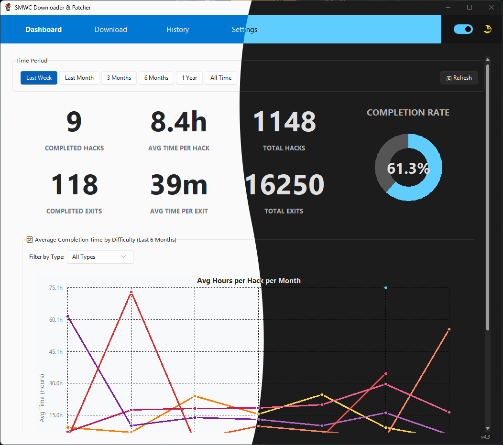
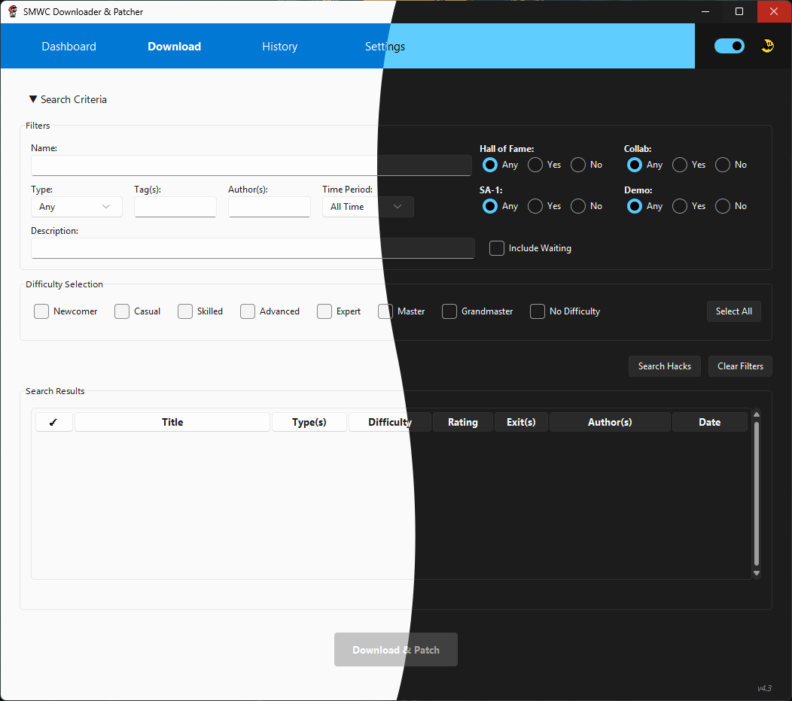
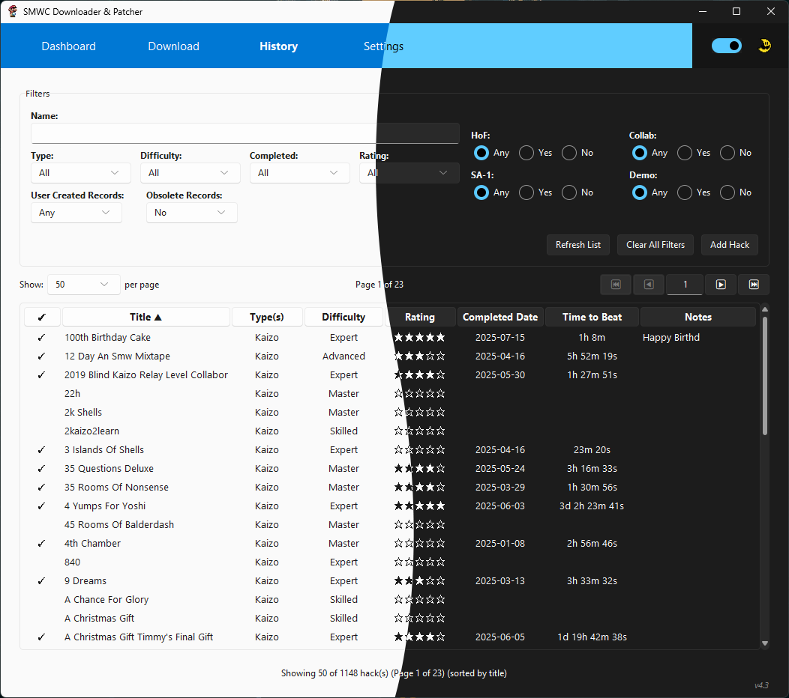
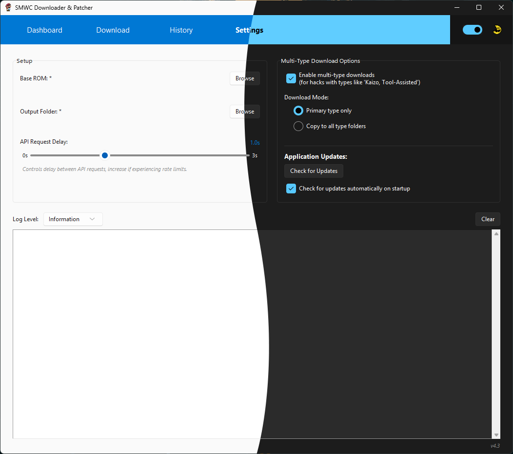

# SMWC Downloader & Patcher

🎮 **Download and play Super Mario World ROM hacks with one click**

A simple desktop app that automatically downloads, patches, and organizes ROM hacks from SMWCentral. Works on Windows, Mac, and Linux.

## 🎯 App Features

### Browse & Download

### Manage Your Collection

### Customize Settings

## 📥 Download & Install

### Windows (10/11)
1. Download `SMWC-Downloader-Windows-x64.zip` from the [Releases page](../../releases)
2. Extract the ZIP file to any folder you want (like your Desktop or Program Files)
3. Double-click `SMWC Downloader.exe` to run the app
4. **If Windows shows a security warning**: Click "More info" → "Run anyway" (this is normal for new apps)

### Mac (macOS 10.15+)
1. Download `SMWC-Downloader-macOS-Universal.dmg` from the [Releases page](../../releases)
2. Open the DMG file and drag the app to your Applications folder
3. **First time only**: Right-click the app → "Open" → "Open" (to bypass security warning)
4. After that, you can launch it normally from Applications or Spotlight

### Linux (Ubuntu, Debian, Fedora, etc.)
1. Download `SMWC-Downloader-Linux-x64.tar.gz` from the [Releases page](../../releases)
2. Extract: `tar -xzf SMWC-Downloader-*.tar.gz`
3. Run the installer: `./install.sh` (this adds the app to your Applications menu)
4. Launch from Applications menu or run `smwc-downloader` in terminal

## 🚀 How to Use

### First Time Setup
1. **Launch the app** - it will open to the main dashboard
2. **Go to Settings**: Click the "Settings" tab at the top of the app
3. **Set your ROM folder**: Click the folder icon to choose where you want your patched ROMs saved
4. **Add your base ROM**: Click "Browse" next to "Super Mario World ROM" and select your clean SMW ROM file
5. **You're ready!** The app will remember these settings and you can return to the main dashboard

### Downloading ROM Hacks
1. **Set your filters**: Use the filter options to narrow down what you want to search for (difficulty, type, author, etc.)
2. **Search for hacks**: Click the "Search Hacks" button to pull data from the SMWCentral API based on your filters
3. **Select hacks to download**: Click the checkmark in the first column for each hack you want to download
   - **Tip**: Click the column header to select ALL hacks at once
4. **Start downloading**: Click "Download & Patch" to begin downloading and patching your selected hacks
5. **Wait for completion**: The app will automatically download each hack and apply it to your base ROM
6. **Play**: Your patched ROMs will be saved to your chosen folder, ready to play in any emulator

**New Feature**: While downloads are in progress, the History tab is temporarily locked to prevent editing and maintain database integrity. You can view your history, but cannot make changes until all downloads complete.

### Managing Your Collection
1. **View your collection**: Click the "History" tab to see all your downloaded ROMs
2. **Add hacks manually**: Use the "Add Hack" button to track hacks you've played from other sources
3. **Track progress**: Mark hacks as completed, rate them (1-5 stars), and add personal notes
4. **Quick editing**: Click directly on completion dates, time to beat, or notes to edit them
5. **Advanced editing**: Double-click any hack to open the full edit dialog
6. **Filter and sort**: Use filters to find specific hacks, or click column headers to sort

### App Settings
- **Download location**: Change where ROMs are saved
- **Multi-type downloads**: Configure how hacks with multiple types (like "Kaizo, Tool-Assisted") are handled
  - **Primary only**: Download to the main type folder only
  - **Copy to all folders**: Create copies in each applicable type folder
- **Auto-updates**: Choose if you want automatic app updates
- **Theme**: Switch between light and dark modes
- **API Delay Slider**: Set delay from 0.0 to 3.0 seconds between API requests to avoid rate limiting issues

## ✨ Key Features

- **Automatic patching**: Downloads the hack and applies it to your ROM automatically
- **Progress tracking**: Mark hacks as completed, rate them, and add personal notes
- **Smart organization**: Keeps track of what you've downloaded with detailed history
- **Advanced filtering**: Find specific hacks by name, author, difficulty, or type
- **Auto-updates**: App keeps itself updated with new features
- **Cross-platform**: Identical experience on Windows, Mac, and Linux

## 🛠️ Troubleshooting

### Windows Security Warning
Windows may show "Windows protected your PC" when running the app. This is normal for new applications. Click "More info" → "Run anyway" to continue.

### Mac Security Warning
macOS may say the app is from an "unidentified developer." Right-click the app → "Open" → "Open" to bypass this. You only need to do this once.

### Linux: App Won't Start
If the app won't launch, install these packages:
- **Ubuntu/Debian**: `sudo apt install python3-tk`
- **Fedora**: `sudo dnf install tkinter`

### Can't Find Downloaded ROMs
Check the folder path shown in Settings. By default, ROMs are saved to:
- **Windows**: `Desktop\SMWCentral Hacks\`
- **Mac**: `Desktop/SMWCentral Hacks/`
- **Linux**: `~/Desktop/SMWCentral Hacks/`

## 📝 What You Need

- **Your Operating System**: Windows 10+, macOS 10.15+, or modern Linux
- **A clean SMW ROM**: Unmodified Super Mario World ROM file (.smc or .sfc)
- **Storage space**: About 20 MB for the app, plus space for your ROM collection
- **Internet connection**: Required for downloading hacks and app updates
- **An emulator**: To play your patched ROMs (SNES9x, RetroArch, etc.)

## 🔄 Updates

The app automatically checks for updates when you start it. When an update is available, you'll see a notification. Click "Update" to download and install the latest version. Your settings and downloaded ROMs are preserved during updates.

---

**Made for the Super Mario World ROM hacking community** ❤️